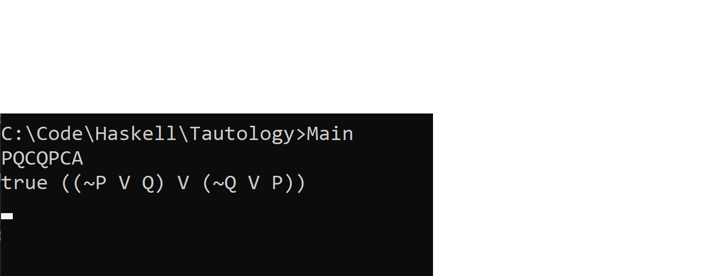

# Tautology

## Input

The Input in Entered as a Postfix Expression

A - Disjunction
C - Implication
D - NAND
E - Equivalence
F - Negation
J - XOR
K - Conjunction

> (P => Q) V (Q => P)
> PQCQPCA

## Result

